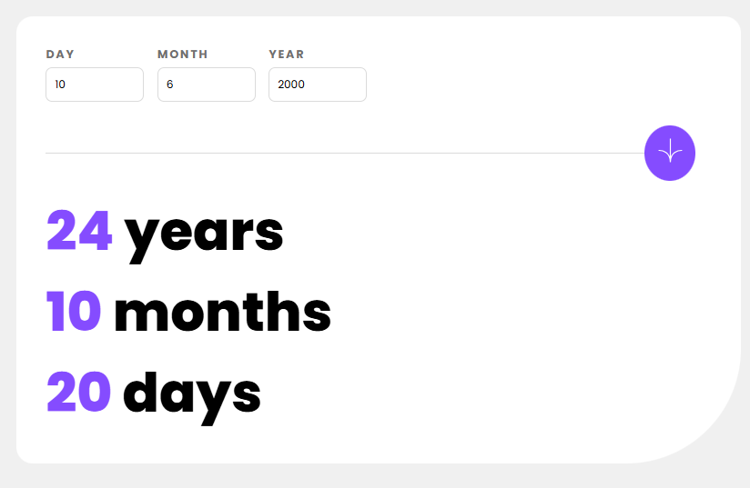

# ⏳ Age Calculator App

Aplicativo web simples e moderno para calcular com precisão a idade com base em uma data de nascimento informada. Digite o dia, mês e ano, e descubra exatamente quantos anos, meses e dias você tem!

## ✨ Tecnologias Utilizadas

- **HTML5**
- **CSS3**
- **JavaScript (Vanilla)**
- **Padrões de acessibilidade e UX**
- **Design responsivo com `@media queries`**

## 🚀 Funcionalidades

- Validação de data completa com mensagens de erro detalhadas
- Cálculo preciso da idade até a data atual
- Interface amigável e responsiva
- Estilo visual elegante e limpo
- Feedback visual imediato ao enviar a data

## 🧠 Lógica do Projeto

Este projeto utiliza a `Date()` do JavaScript para calcular a diferença entre a data atual e a data de nascimento fornecida pelo usuário.  
Além disso, inclui:

- Verificações manuais para dia, mês e ano válidos
- Ajustes para casos em que o dia ou mês atual ainda não foi alcançado no ano corrente

## 📸 Preview

  

## ✒️ Colaboração

- **JavaScript**: Desenvolvido por **[Raphael](https://github.com/Spaceza)**
- **HTML** e **CSS**: Estrutura fornecida pela professora **[Ana Luisa Santos](https://github.com/analuisadev)** como base de referência para o projeto
